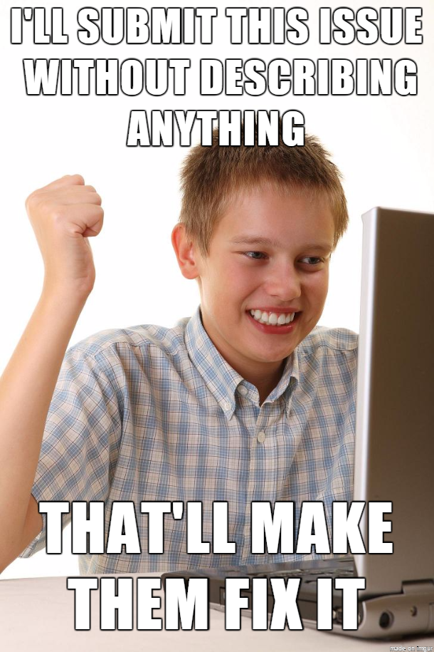

# Github etiquette

## Opening issues
There are multiple situations in which you might want to open an issue:
- to report an error you need help with
- discuss a high-level topic or idea (e.g. policies, community)
- propose a new feature or idea

Now... have you ever tried to fix something without knowing what needed to be solved? Huh?

Exactly... when submitting an issue make sure you include the following information, you know, to make everybody's lives easier:
- What you were trying to do? What were the conditions that produced this specific error?
- What actually happened... if you have a screenshot add it here!
- Other important details such as OS, versions you were using, etc.

## Making a pull request
Let's say you found a bug in someone else's code or have been asked to contribute to a project. Here's how you can submit your pull request with confidence.

### Be clear and specific
There is a comment box for a reason, you should type in the following information there:
- explain what the problem is and how your changes fix this
- if your PR solves an open issue make sure you reference this
- have screenshots to show the tests/improvements? Add them

### Keep changes small
if you have found 5 bugs and were determined to fix them all consider making separate PR for each of this.
This will allow the repository owner to deal with the PR quicker and more efficiently.

## Describe your changes well in each commit

Commit messages are invaluable to someone reading the history of the code base, and are critical for understanding why a change was made.

Try to ensure that there is enough information in there for a person with no context or understanding of the code to make sense of the change.

Where external information references are available - such as Issue/Story IDs, PR numbers - ensure that they are included in the commit message.

Remember that your commit message must survive the ravages of time. Try to link to something that will be preserved equally well -- another commit for example, rather than linking to master.

** Each commit message should include the reason why this commit was made. Usually by adding a sentence completing the form 'So that we...' will give an amazing amount of context to the history that the code change itself cannot **

## Make atomic changes
If you make two specific changes make sure to add them in separate commits. Each commit should cover everything related to the change.

## Receiving a pull request
You might also be on the other side of the PR.
Sometimes when having open repositories we receive unexpected PRs.
Make sure you remember this:
- don't be rude
- don't fix their mistakes... shall you find that their proposed solution does not help or cause additional issues explain this to the author

## Reviewing pull requests
Most of the time the repository owner(s) will look at the PR and evaluate if this needs merging into the main repository.
Reviewing a PR works pretty much like the peer-review process of a scientific journal.
Often you will require others to have a look at your code, in this cases, you can directly assign them as reviewers.

It's a reviewers responsibility to ensure:

- commit history is good
- good changes are propagated quickly
- code review is performed
- they understand what is being changed, from the perspective of someone examining the code in the future

---
Also make sure you read [GitHub user guide to project contribution](https://opensource.guide/how-to-contribute/)
