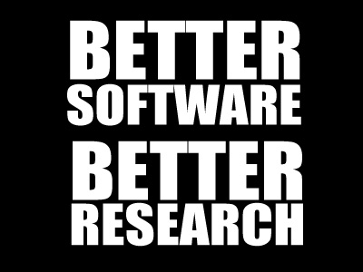

# Onboarding for OOOminders

This is your starting point to get you up and running with your computational work as an OOOminder.

(Please note that this is still a work in progress and you can help to make this a better onboarding experience for those that come after you! Want to add something? Create a Pull request and get going 👩🏻‍💻)

This repository will point you to some useful resources and will help us to keep track of the work being developed as part of the project. It will as well, serve as the main point of technical contact between you and your RSE.

Don't worry if I have already used loads of words you have never heard before... you will get familiar with all of this sooner than you think.

## Getting you up and running
You will be needing a lot of software to be installed... we tried to gather a sensible amount of resources that will get you going for now.

### Site licensed software

The main point of access to get licensed software as a PhD student or staff at the university of Sheffield is via the [CiCS software website](https://www.sheffield.ac.uk/software/).

Head there and request the following software:
- MATLAB
- Intel Parallel Studio XE Composer

Make sure you are logged into your MUSE account first.

Once you have done this head to [https://www.visualstudio.com](https://www.visualstudio.com) and get the Visual Studio community edition (Make sure you get the community edition or you'll have to pay for this!!!)

### Open Source software
We will also need you to install the following open source software:

- **Git** is what we will be using for version control for all the software we will develop over the course of this project. So go to [the git website](https://git-scm.com/book/en/v2/Getting-Started-Installing-Git) and get it installed on your computer.
- **Text editor:** You will need a text editor as well. Our favourite is [Atom ](https://atom.io) as this integrates really well with Git and is a rather flexible and customisable editor. Petar's favourite is [Sublime  text](https://www.sublimetext.com), both are multi-platform.
If you prefer any other (Notepad ++, vim, sublime) go ahead and make sure you have this installed.
- **R and RStudio**: R is an excellent statistical open source software and Rstudio an awesome IDE to work with. Get the latest R version from [here](https://www.r-project.org) and RStudio from [here](https://www.rstudio.com).
- **Anaconda**: [Anaconda ](https://docs.continuum.io/anaconda/install/) is a flexible easy-to-install package manager, environment manager and Python distribution.

If you installed the full Anaconda version you might already have the Anaconda Navigator installed as well as Spyder and Orange, just to be sure install them via conda:
```bash
$ conda install spyder, orange3
```

Finally, we will need a package called **r-feather**, which will allow Python and R to communicate with each other. You will need to install this on both R and Python.
From [conda](https://anaconda.org/r/r-feather):
```bash
$ conda install -c r r-feather
```

For [R](https://cran.r-project.org/web/packages/feather/README.html):
```R
install.packages('feather')
```

## Following steps
Some other things that you will need to do:

- Dust off your command line skills: we have a mini (really mini) tutorial on the  command line. Feel free to head [here](https://github.com/mikecroucher/Intro_to_HPC/blob/gh-pages/terminal_tutorial.md) and have a look at this.

Not feeling super confident using the command line for all your version control tasks or are you a very visual person (like [Tania](https://github.com/trallard))?

 Consider using a GUI client for your version control tasks.
My favourite is [GitKraken](https://www.gitkraken.com). Although others prefer [GitHub desktop](https://desktop.github.com)

You can use a mixture of GUI and command line for your workflow... writing good software and following best practices should not be overcomplicated, but it takes practice and commitment (just like science right?).

- You will be required to attend a RSE workshop/induction in the next couple of weeks, make sure to check the project google calendar for the full details.


Induction                                                        | Facilitator  | Date     |
|------------------------------------------------------------------|--------------|----------|
| Getting started with version control and software best practices | Tania Allard | 06/09/17 |


- Get a GitHub account at [ https://github.com](https://github.com)
  - **PhDs**: you might want to apply for a [student developer pack](https://education.github.com/pack). It comes with loads of cool tools for software development (including free TravisCI for your projects)
  - **RAs**: you cannot get a student's account but you can get a get a discount [here](https://education.github.com/discount_requests/new) and this will allow you to have free private repositories

## Some useful resources
If you want to refresh some of your skills before your upcoming induction session feel free to visit the following resources:

- [Ten simple rules for taking advantage of Git and GitHub](http://journals.plos.org/ploscompbiol/article?id=10.1371/journal.pcbi.1004947)
- [Code school Try.git interactive tutorial](https://try.github.io/levels/1/challenges/1)
- [Markdown cheatsheet](https://github.com/adam-p/markdown-here/wiki/Markdown-Cheatsheet)
- [Git command line cheatsheet](https://services.github.com/on-demand/downloads/github-git-cheat-sheet.pdf)
- [Git glossary](https://help.github.com/articles/github-glossary/)

If you have identified any other awesome and useful resources that you want to share with the team please add them here!

## Something else... Storage!!
We currently have 10 Terabytes of storage. Contact Mike Croucher or Petar to be added to the group of people who can access this.

On ShARC, this storage is at `/shared/ooominds1`. Note that if you do

`ls /shared/`

the `ooominds1` directory might not appear. This is because it is made available on demand. One way to demand it is just to go there. i.e. do

`cd /shared/ooominds1`

The storage area can also be made available on your own desktops and laptops.
Details can be found [here](https://www.sheffield.ac.uk/cics/research-storage/using-research-storage).

### **Important**:
if you feel you need additional training or are struggling with your software do not hesitate and approach your RSE, she/he will be happy to discuss this with you and point you in the right direction

We are here to help you to develop better research software...

<center></center>
